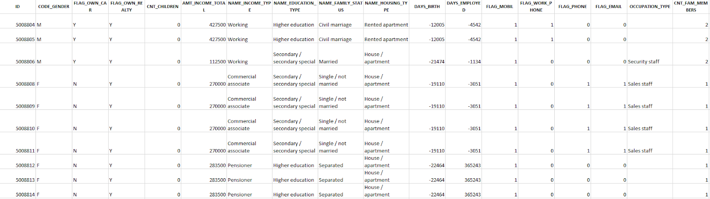
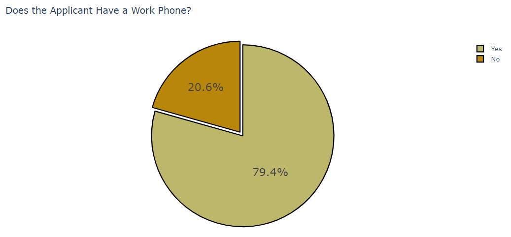
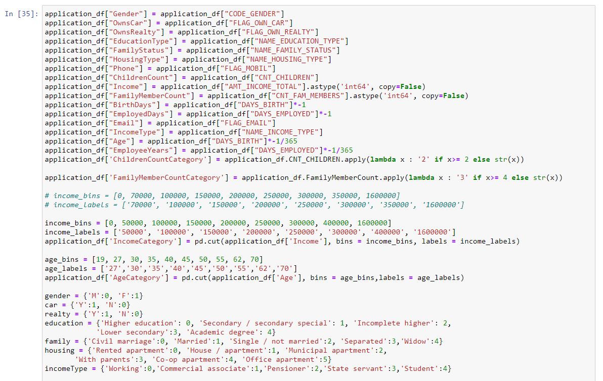
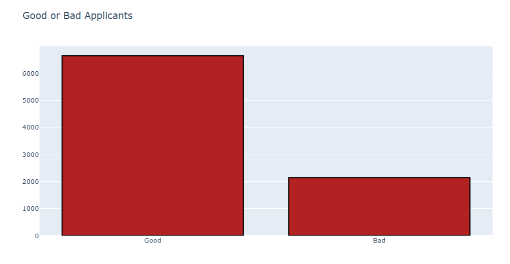
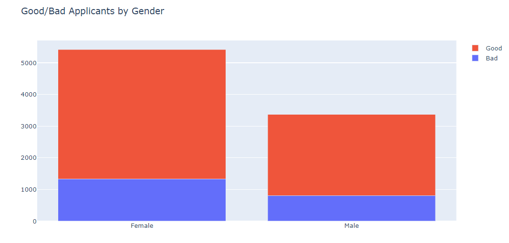
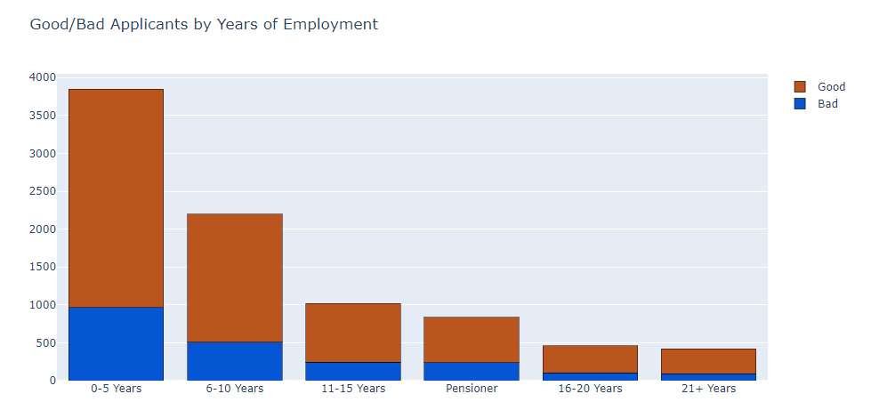
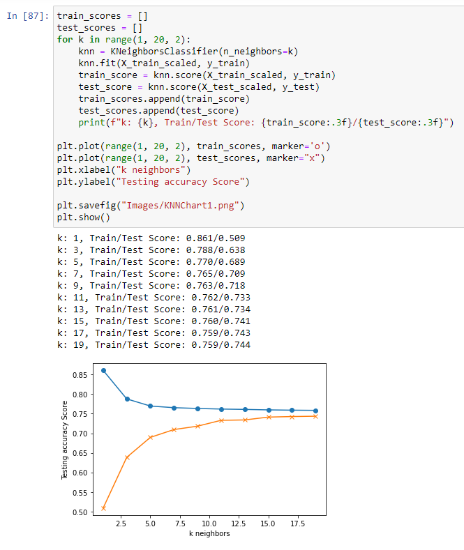
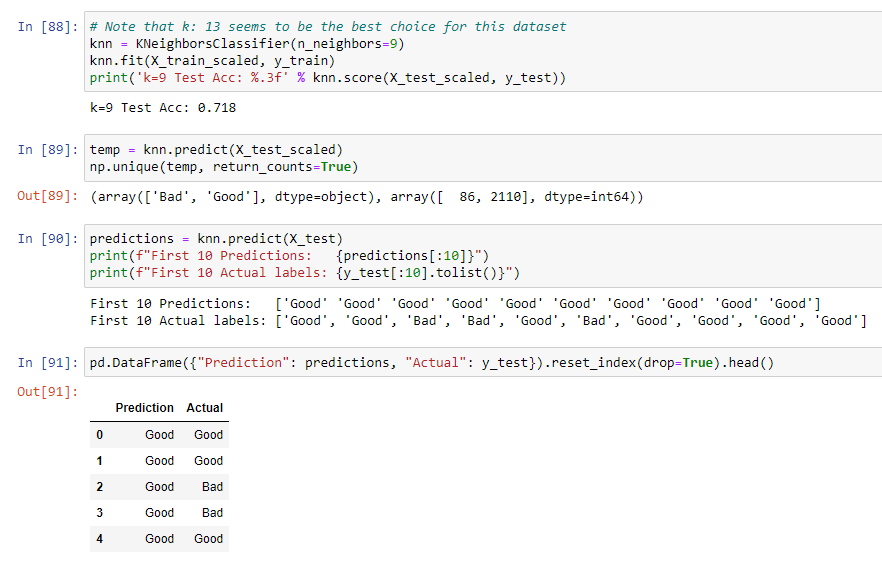

# Final Project - Credit Card Approval Prediction
Team Members: 
- Stefanee Richardson: https://www.linkedin.com/in/stefanee-richardson-69629061/
- Tiffany Teasley: https://www.linkedin.com/in/tiffany-teasley/
- Mabel Duran-Sanchez: https://www.linkedin.com/in/mabelduransanchez/
- Melodie Vines: https://www.linkedin.com/in/melodiestaton/

Launch the app: https://shrouded-ocean-97702.herokuapp.com/

ABOUT OUR PROJECT

We chose to "create" our very own banking institution called MMTS Bank for our final project. Among the many services MMTS Bank provides is access to a credit card.

Given the high volume of credit card applicantions, our team decided to use a ML model to help us more efficiently review the applications. The goal is for our ML model to accurately and efficiently approve/deny credit card applications.

As you navigate through this site, you will see that the Home page consists of our credit card application (feel free to give it a try yoursefl!). The Data page gives some insight into the data we utilized to train our models. The pages under the ML Models navigation dropdown menu show the different models we trained and tested.
    
    
DATA EXPLORATION
 
After reviewing several datasets, we came across a dataset often used by other data scientists to do similar work which predicts whether or not to approve a candidate for a credit card.

Existing client records in CSV format were utilized to determine which clients should and should not be approved. We then utilized this data to determine if a new applicant would be a good candidate for our credit card services.

The first CSV file imported into our Jupyter Notebook for analysis included prior applicant information ranging from their gender to their income and employment status to everything in between.

To better visualize and explore the existing data, we created several graphs on the 17 different variables within the CSV file.

The second CSV file contained a record per month for each applicant and whether they had paid their dues on time and if not, how many months they were behind in paying on their credit card. 

Visualizations also helped us see general trends, for instance, that the data  has more female than male applicants. There were also three columns total to represent phones: “FLAG_MOBIL,” “FLAG_WORK_PHONE” and “FLAG_PHONE”. Since we were unclear as to what “FLAG_PHONE” represented and “FLAG_MOBIL” was a “Yes” for all candidates, we decided that these columns were not needed in the model.

To view the original dataset we utilized for this project from Kaggle, click here: https://www.kaggle.com/rikdifos/credit-card-approval-prediction.

DATA CLEANUP

The data cleanup process for the first CSV containing the demographic information of applicants consisted of simplifying column header names and transforming large numerical values into more legible numerical values. For instance, the “DAYS_EMPLOYED” column was renamed to “EmployeeYears” and values like “-4542” were multiplied by -1 and divided by 365 days to get values like “12.443836” which are much easier to understand. For the categorical columns we converted them to numerical values.

We also grouped like values into a smaller number of “bins.” For instance, the “EmployeeYears” column originally had a wide range of values from -1 (for those on their pensions) to 21+ years of experience and we binned these numbers to create the following categories in the “EmployeeYearsCategory” column: -1, 0-5, 6-10, 11-15, 16-20, 21+).

With the second CSV file containing credit card payment histories, we developed some conditions to determine whether applications should be approved or are “Good” or if they should be denied or are "Bad."

We added a column to this dataframe titled “Label” which labeled applicants depending on which condition they met. We then merged our dataframe with "Good" and "Bad" labels with our dataframe with demographics on the “ID” column to create one master dataframe. After merging these dataframes we found that the majority of applicants were considered "Good" with approximately 2,000 considered "Bad."

LOGISTIC REGRESSION MODEL

Logistic regression is a model that can predict a binary outcome. We initially believed this would be the best model for us to determine if an applicant would be a "Good" or bad applicant.

When we modeled the data using logistic regression, all of the test applicants were identified as good. The model did not perform as we had hoped. We later learned that although logistic regression models due indeed provide binary outcomes, they must be of numerical nature. In other words, logistic regression models cannot answer yes or no questions.

KNN MODEL

The KNN model is a clustering model. These models work best for data which can easily be clustered together. The model creates clusters based on the center of grouped values and creates “neighborhoods” based on the nearest neighbors’ values. This model clustered our data based on whether applicants met the conditions to be considered “Good” or “Bad” applicants.
 
We tested the KNN model two times. The first time we tested the KNN model we used all of the data elements and all of the records. In the data, approximately 90% of the applicants are Good and 10% of the applicants are deemed Bad. The KNN model did predict some patients as Bad but not very many. 

The second time we modelled the data we used a recommendation to equal the amount of data being fed into the model between Good and Bad applicants. We then sent into the model 2000 Good applicants and 2000 Bad applicants. This time the model did predict more Bad applicants and was closer to the actual Good/Bad applicants. 

